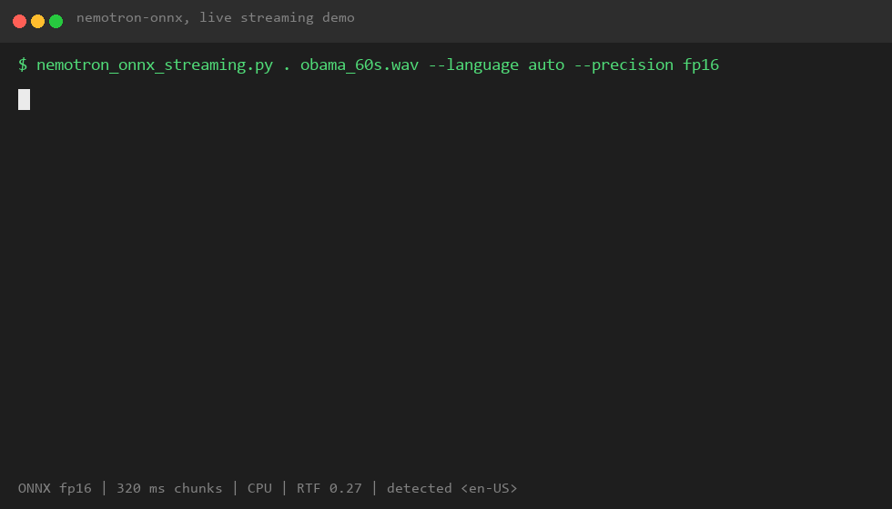
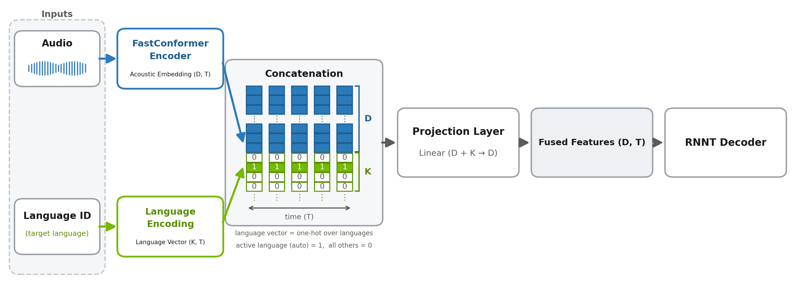

<div align="center">

# Nemotron 3.5 ASR Streaming, ONNX

**Whisper large-v3-class multilingual ASR that actually streams, on your CPU.**

[](https://huggingface.co/codavidgarcia/nemotron-3.5-asr-streaming-0.6b-onnx)
[](LICENSE)
[](https://openmdw.ai/license/1-1/)
[](https://onnx.ai/)
[](https://onnxruntime.ai/)

[Model weights](https://huggingface.co/codavidgarcia/nemotron-3.5-asr-streaming-0.6b-onnx) ·
[Base model (NVIDIA)](https://huggingface.co/nvidia/nemotron-3.5-asr-streaming-0.6b) ·
[Validation](#validation) ·
[Debugging notes](#debugging-notes-the-kv-cache-ordering-bug)



</div>

Export NVIDIA's [`nvidia/nemotron-3.5-asr-streaming-0.6b`](https://huggingface.co/nvidia/nemotron-3.5-asr-streaming-0.6b),
a multilingual (40 locales) cache-aware FastConformer-RNNT **streaming** ASR
model, to ONNX. Run it with a small streaming engine that only needs
**numpy + onnxruntime**.

**📦 Weights (fp16, ready to download):**
[`codavidgarcia/nemotron-3.5-asr-streaming-0.6b-onnx`](https://huggingface.co/codavidgarcia/nemotron-3.5-asr-streaming-0.6b-onnx)

- 🌍 One 600M model, 40 language-locales, automatic language detection (`<xx-XX>` tags)
- ⚡ True cache-aware streaming: 80 ms to 1.12 s configurable chunks, native punctuation/casing
- 💻 About 3.8x real-time on CPU (RTF 0.26 fp32). No PyTorch, no GPU required.
- 🎯 Measured parity vs the original: **WER 0.0137** (fp16) / **0.0082** (fp32)
- 📉 Whisper large-v3-class multilingual quality that **actually streams**, at about 1/3 of the parameters, on your CPU

> Unofficial community export by [@codavidgarcia](https://huggingface.co/codavidgarcia).
> Weights remain NVIDIA's under [OpenMDW-1.1](https://openmdw.ai/license/1-1/).
> All code here is Apache-2.0 (see `LICENSE`).

## Quickstart

Use the prebuilt ONNX package from Hugging Face:

```bash
pip install numpy onnxruntime soundfile scipy
huggingface-cli download codavidgarcia/nemotron-3.5-asr-streaming-0.6b-onnx --local-dir ./onnx-out

python engine/nemotron_onnx_streaming.py ./onnx-out meeting.wav \
    --language auto --chunk-ms 320 --precision fp16
# text: Actually, the masterminds behind this ...
# detected language: <en-US>
# RTF: 0.287
```

In Python:

```python
from nemotron_onnx_streaming import NemotronOnnxStreaming

engine = NemotronOnnxStreaming("./onnx-out", language="auto", chunk_ms=320, precision="fp16")
engine.accept_waveform(pcm_float32_16k)   # feed any number of samples
print(engine.get_partial())               # live hypothesis
print(engine.get_final())                 # flush + final transcript
print(engine.detected_language, engine.rtf)
```

Regenerate the ONNX graphs yourself (any chunk size, fp32/fp16/int8):

```bash
pip install -r requirements.txt   # torch (CPU ok) + transformers>=5.13 + onnx
python export/export_onnx.py --output-dir ./onnx-out --chunk-ms 80,320,1120 --validate
python export/quantize.py --model-dir ./onnx-out --fp16
python validation/parity.py --wav-dir ./test_wavs --model-dir ./onnx-out --language auto
```

## How it works

<p align="center">
  
  <br/><sub>Architecture (image: NVIDIA). The FastConformer encoder output is concatenated with the language-ID encoding and projected into the RNNT decoder.</sub>
</p>

Grounded in the transformers implementation (`transformers.models.nemotron3_5_asr`
+ `nemotron_asr_streaming`, v5.13.0):

- **Encoder** (`encoder_{ms}ms[_first].onnx`): one cache-aware FastConformer
  streaming step with **flat tensor I/O**. Mel features in, encoder frames
  out, and every piece of streaming state explicit: 56 left-context attention
  K/V frames per layer (24 layers), subsampling Conv2d left-context, and
  conformer depthwise-conv left-context. First-chunk and steady-state
  variants (the first chunk prepends NeMo's `init_pad` zero frame). The
  language prompt (128-dim one-hot over `prompt_ids`, fused by
  `prompt_projector`) is baked into the graph, so one encoder serves all
  languages and `auto` (index 101).
- **Decoder** (`decoder.onnx`): RNNT prediction network (embedding + 2-layer
  LSTM) as a single-token step with LSTM state in/out. State is committed
  only when a non-blank token is consumed (HF masked-cache semantics).
- **Joiner** (`joiner.onnx`): `logits = Linear(relu(enc + dec))`.
- **Engine** (`engine/nemotron_onnx_streaming.py`): numpy log-mel extractor
  bit-compatible with HF's (max diff 3.7e-9 vs librosa), chunk scheduling
  matching the HF processor (`1+8*r` mel frames first, `8*(r+1)` steady),
  RNNT greedy decode with `max_symbols_per_step=10`, language-tag handling,
  partial/final results. About 600 lines.

## Validation

6 real meeting-audio files (3 to 60 s, `language=auto`), jiwer,
torch 2.13 CPU + onnxruntime 1.27, opset 17:

| Precision | WER vs HF reference | RTF (CPU) | Size (320 ms) |
| --- | --- | --- | --- |
| **fp16 (shipped)** | **0.0137** | 0.315 | ~2.5 GB |
| fp32 | 0.0082 | 0.263 | ~4.7 GB |
| int8 (dynamic) | 0.189 | 0.148 | ~0.7 GB |

| Chunk | Latency | RTF (fp32, CPU) |
| --- | --- | --- |
| 80 ms | ~0.08 s | 0.653 |
| 320 ms | ~0.32 s | 0.263 |
| 1120 ms | ~1.12 s | 0.106 |

Graph-level parity vs the HF cache-aware streaming path stays below 1.5e-05
over first + 5 steady chunks. Text-level parity is near-verbatim at 320 ms
and 1120 ms (cross-checked against HF streaming at the same lookahead).
"Parity" here means fidelity of the conversion. For absolute ASR accuracy,
see NVIDIA's FLEURS tables on the base model card.

## Debugging notes: the K/V cache-ordering bug

The only non-trivial bug in this export. Transcriptions were correct for the
first chunk and garbage after that.

Root cause: the 96 cache tensors (K + V across 24 layers, plus conv caches)
go through the ONNX graph as positional inputs/outputs. The first version
listed them interleaved (`k0, v0, k1, v1, ...`) while the graph body unpacks
them blocked (`caches[0:24]` = K, `caches[24:48]` = V). Every layer from 1
up got another layer's K as its V.

Chunk 0 was unaffected because all caches start as zeros, and any permutation
of zeros is still zeros. The decoder state was corrupted from the first
carry-over onward. A 60 s file produced just *"Actually, that's a lot."*

Ruled out first: the Transformer-XL relative-position theory (warm-up
`cached_frames` growing 4, 8, ... vs a fixed window of 56). The warm-up
encoding is an exact centered slice of the full one (diff 0.0), so that path
was fine. The actual cause showed up by localizing the first divergent
layer and recording the attention inputs: V off by 430, K matching to 3e-5.

Fix: one loop in `_cache_shapes()` (`export/export_onnx.py`). The debug
probes are in `tools/` (layer-localized parity, cache sweep, attention
replay, input recorder).

## Repo layout

```
export/export_onnx.py      HF checkpoint -> ONNX (encoder first/steady, decoder, joiner) + --validate
export/quantize.py         int8 dynamic quant + custom fp16 cast (>2 GiB-safe)
engine/nemotron_onnx_streaming.py   numpy+onnxruntime streaming engine / CLI
validation/parity.py       WER-parity harness (HF reference vs ONNX, per-file + aggregate)
validation/make_reference.py        generate HF reference transcripts
validation/hf_streaming_reference.py  HF streaming reference at a given lookahead
tools/                     debugging probes (see Debugging notes)
outputs/                   (git-ignored) exported graphs
```

## Related work

[onnx-community's int4 build](https://huggingface.co/onnx-community/nemotron-3.5-asr-streaming-0.6b-onnx-int4)
targets the smallest footprint with onnxruntime-genai at a fixed 560 ms
chunk. This repo covers the complementary case: the model's original
accuracy preserved (fp16) on plain onnxruntime, plus the tooling to
reproduce and verify everything.

## Roadmap

- [ ] int8 static quantization with calibration (dynamic int8 measurably degrades WER)
- [ ] Deduplicate encoder weights across chunk sizes (one shared external-data store)
- [ ] sherpa-onnx C++ port ([sherpa-onnx#3573](https://github.com/k2-fsa/sherpa-onnx/issues/3573)). The engine is meant as the reference implementation
- [ ] Word-level timestamps, batched streaming, CUDA-EP tuning

## Credits and license

Export, engine, fp16/int8 conversion and validation by
[@codavidgarcia](https://huggingface.co/codavidgarcia). If this saved you
time, a star helps others find it.

- **Code**: Apache-2.0 (`LICENSE`).
- **Weights**: NVIDIA, [OpenMDW-1.1](https://openmdw.ai/license/1-1/). Not
  affiliated with or endorsed by NVIDIA. See the model repo for the
  redistributable package.
